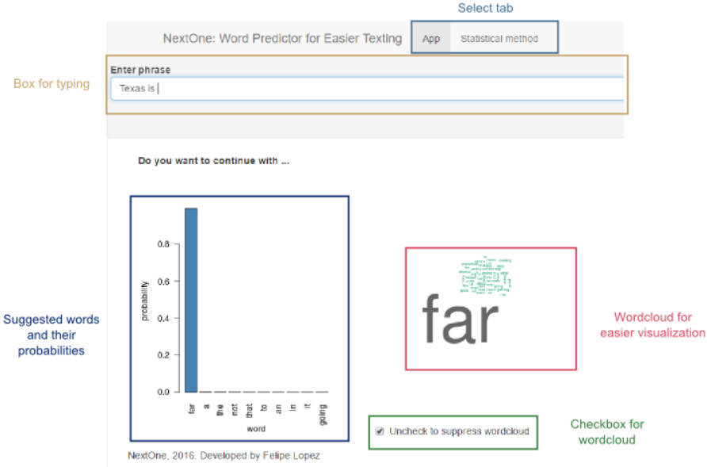

NextOne: Easier Texting
========================================================
author: Felipe Lopez

Texting should be easier
========================================================

Texting is the most widely-used form of communication in the US. 97% of Americans text at least once a day.

Most texts are written in less than 5 seconds.

Short  times + tiny screens = Typos.

Various apps try to make texting easier by predicting what you meant or what you want to say next: Swiftkey, Swype, Fleksy, etc. With these apps we want to get to know you and the way you text so we can predict what you'll type next and suggest a shortcut!

 

NextOne: How to use
========================================================

What does NextOne do?
========================================================

For this example we used English texts ownloaded from the HC Corpora, a collection of text files from newspapers, magazines, blogs and Twitter updates.  Text data was preprocessed before being mined.

All text mining an natural language processing was done using R libraries like tm, RWeka, stringi, hashFunction, wordcloud, and parallel.

The stupid backoff algorithm based on an n-gram language model is used to predict the most likely word to be entered next based on the three previous ones. The system was modeled as a third-order Markov process because  of simplicity and due to memory limitations and for fast operation. The algorithm has the following steps:

- Take the last three words and look for tetra-grams. Then find the relative frequency of each word F1.
- Take the last two words and look for tri-grams. Then find the relative frequency of each word F2.
- Take the last word and look for bi-grams. Then find the relative frequency of each word F3.
- Find the relative frequency of the most common words F4.
- Define a factor a < 1, such that the likelihood of a word is given by F = F1  + a ( F2 + a ( F3  + a F4 ) ). The factor a ensures that closer attention is paid to higher n-grams.
- Then the 100 more likely words (higher F ) are selected and the likelihoods are normalized.

NextOne performance
========================================================

The accuracy obtained with this example was between 15-25%, depending on the testing set. The accuracy may seem low but so far it considers only word-to-word relationships without updating when the first letters of the new word have already been entered. Adding such capabilities is expected to improve the accuracy of NextOne.

The alpha version is available at https://lopezfelipe.shinyapps.io/Week04/

The source code can be downloaded from https://github.com/lopezfelipe/NextOne

For comments and suggestions, email felipelopez@utexas.edu
